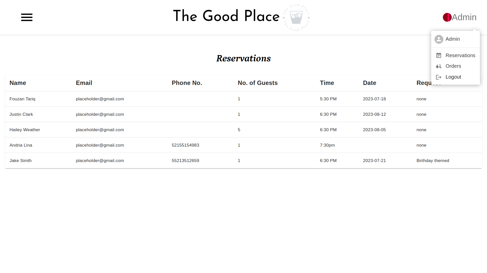
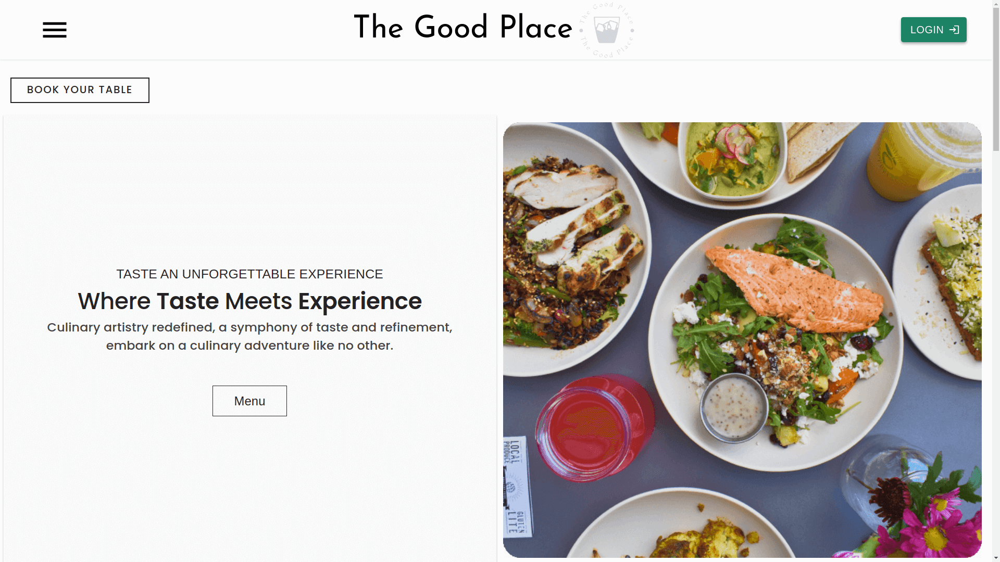
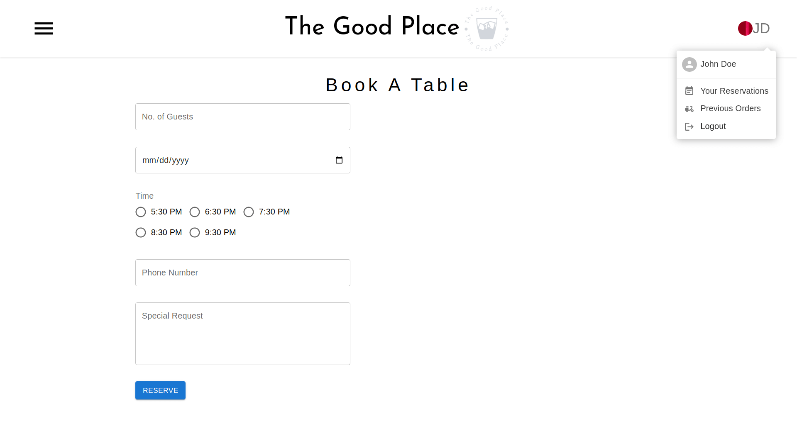
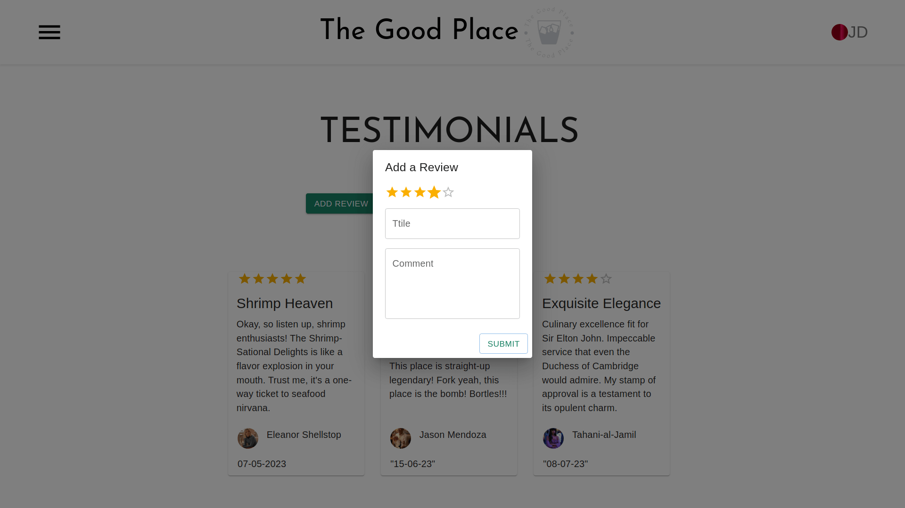

  
  
  
  

# The Good Place

A restaurant website.

## Table of Contents

- [Technologies Used](#technologies-used)
- [Main Features](#main-features)
- [Getting Started](#getting-started)

## Technologies Used:

- React
- Material UI
- Redux for state management
- Firebase for backend services
- Firebase Authentication for user authentication
- Email.js for sending contact emails

## Main Features:

- **User Authentication**
  - Sign up and log in for customers
  - Admin authentication for restaurant staff
- **Reservation System**
  - Customers can make reservations
  - Admins can manage reservations
- **Ordering**
  - Customers can place orders
  - Admins can track orders
- **Contact Form**
  - Contact the restaurant via email
  - Utilizes Email.js for sending emails

## Getting Started

To get started with the The Good Place, follow these steps:

1. Clone or download the repository to your local machine.
2. Install any necessary dependencies using npm or yarn.
3. Run the app on your local development environment.
